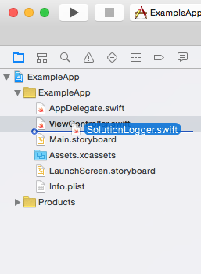

# Installationsanleitung SolutionLogger
Mit der SolutionLogger-Klasse der [HSR App Quest](http://appquest.hsr.ch/) kannst du einfach Einträge ins
[Logbuch](https://github.com/tonisuter/AppQuest-Logbuch) machen. Mit der folgenden Anleitung kannst du die Klasse in deinen eigenen Apps (Metalldetektor, Grössenmesser, usw.) verwenden:

#### 1. SolutionLogger herunterladen
Du kannst dieses Repository entweder mit dem Befehl `git clone git@github.com:tonisuter/AppQuest-SolutionLogger.git` klonen oder einfach den aktuellen Stand [als Zip-Datei herunterladen](https://github.com/tonisuter/AppQuest-SolutionLogger/archive/master.zip).

#### 2. SolutionLogger.swift ins Xcode-Projekt importieren
Nun muss die SolutionLogger-Klasse nur noch ins Xcode-Projekt der jeweiligen App importiert werden. Dazu kannst
du einfach die Datei `SolutionLogger.swift` vom Finder in den Projekt-Navigator von Xcode ziehen (siehe Bild) und im Dialog auf "Finish" klicken.

